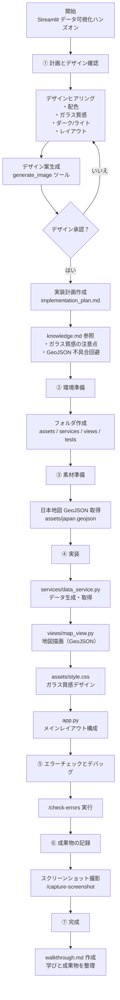

ダッシュボードを作成していきます。
作成手順自体はワークフロー化されているものを使います。
モデルはGemini 3 Pro(High)を選択します。
チャット欄に```/hands-on```と入力し送信してください。
:::message
デザインのヒアリング後にイメージ生成が行われますが無料枠だと3~5枚程度しか生成できません。
また、手順をやり直す場合は新しいチャットを作成してください。
:::

:::details デザインプロンプト例
背景画像は正月をイメージした躍動する水墨画風の馬をイメージ。
背景は中程度の適度な透明感。
文字は日本語。
画面上部に都道府県の人口が多い上位5を表示。
都道府県ごとに2021年から2026年の人口のダミーデータを作成しテーブルを右側に配置
ヒートマップ赤系で作成。
ヒートマップの下に年代を変更できるスライダーを追加。
:::


フローは以下のようになります。
ダッシュボードのデザインを伝えることでダッシュボードを作成してくれます。




:::details テスト時に生成されたイメージと作成されたAPP
作成されたイメージ


作成されたAPP


作成されたWalkthrough


:::


最後に手動チェック
スクリーンショットがうまく行かない場合もあるので
```command + j```でパネルを切り替えポートタブのポートの転送に8501を追加し ```http://localhost:8501```にアクセスして確認してみましょう。

APPの作成はうまくいきましたか？
作成したAPPがうまく作れなかった場合はwalkthrough(成果物ドキュメント)にレビューコメントを入れたり『エラー内容を確認して』と指示を出したりして修正することができます。
うまく作成できた場合は更なる機能拡張や別のAPP開発をして遊んでみてください。
新しくAPP開発を行う場合は```.agent/rules/streamlit.md```の内容を適宜修正してください。
お疲れ様でした。
